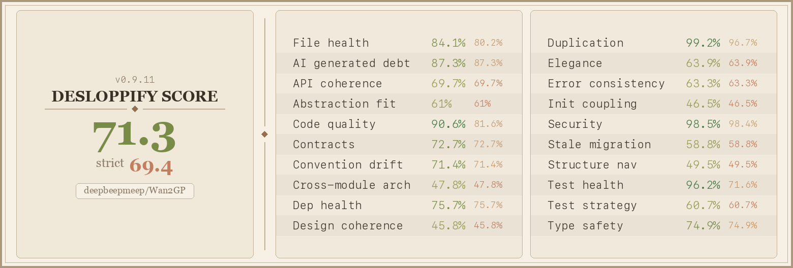

# Reigh-Worker

GPU worker for [Reigh](https://github.com/banodoco/Reigh), for running locally or in the cloud via [Reigh Worker Orchestrator](https://github.com/banodoco/Reigh-Worker-Orchestrator/) — processes video generation tasks using [Wan2GP](https://github.com/deepbeepmeep/Wan2GP).

## Quick Start

```bash
# 1. Linux baseline: Ubuntu 22.04/24.04 with NVIDIA drivers, ffmpeg, git, curl
#    Ubuntu 24.04+ needs Python 3.10 from deadsnakes before the command below works:
#    sudo add-apt-repository ppa:deadsnakes/ppa && sudo apt-get update

# 2. Bootstrap uv once
curl -LsSf https://astral.sh/uv/install.sh | sh
export PATH="$HOME/.local/bin:$PATH"

# 3. Sync the locked environment from the repo root
uv sync --locked --python 3.10 --extra cuda124

# 4. Run the worker
uv run --python 3.10 python run_worker.py \
  --reigh-access-token "your-worker-token" \
  --wgp-profile 4 \
  --idle-release-minutes 15
```

Get credentials from [reigh.art](https://reigh.art/).

The Reigh app now generates two command tabs:
- `Install`: bootstrap or force-resync at the configured `Worker repo location`
- `Run`: the normal day-to-day launch path, which still runs `uv sync` before starting

Both commands always `cd` into the configured repo path first so copy-pasting from a fresh terminal in your home directory still works.

## Packaging Notes

- `pyproject.toml` is the canonical dependency definition for the worker runtime.
- `requirements.txt` remains committed as rollback ballast during the rollout.
- `uv.lock` is expected to be refreshed from the worker repo root with Python 3.10.
- `Wan2GP/requirements.txt` now comes from the pinned `Wan2GP/` submodule. If upstream requirements change, bump the submodule pointer, mirror the required dependency changes into the root project metadata, and regenerate `uv.lock`.

## Rollback

- There is no runtime pip fallback on the migrated branch. Failed `uv sync` runs should fail loudly.
- If the very first uv-based launch fails after migrating an existing machine, restore the newest `venv.pre-uv-*` or `.venv.pre-uv-*` backup back to `venv/` or `.venv/`, remove `.uv-migrated`, and investigate from there.
- If the release itself must be rolled back, revert the uv rollout commits and return to the pre-uv revision that still bootstraps from the committed `requirements.txt`.

## Standalone Usage

Use the generation engine without Reigh for local testing or custom pipelines:

```bash
# Join two video clips with AI-generated transition
python examples/join_clips_example.py \
    --clip1 scene1.mp4 --clip2 scene2.mp4 \
    --output transition.mp4 --prompt "smooth camera glide"

# Regenerate corrupted frames
python examples/inpaint_frames_example.py \
    --video my_video.mp4 --start-frame 45 --end-frame 61 \
    --output fixed.mp4 --prompt "smooth motion"
```

### Using HeadlessTaskQueue Directly

```python
from headless_model_management import HeadlessTaskQueue, GenerationTask
from pathlib import Path

queue = HeadlessTaskQueue(wan_dir=str(Path(__file__).parent / "Wan2GP"), max_workers=1)
queue.start()

task = GenerationTask(
    id="my_task",
    model="wan_2_2_vace_lightning_baseline_2_2_2",
    prompt="a cat walking through a garden",
    parameters={"video_length": 81, "resolution": "896x512", "seed": 42}
)

queue.submit_task(task)
result = queue.wait_for_completion(task.id, timeout=600)
print(f"Output: {result.get('output_path')}" if result.get("success") else f"Error: {result.get('error')}")

queue.stop()
```

## Debugging

```bash
uv run --python 3.10 python -m debug task <task_id>          # Investigate a task
uv run --python 3.10 python -m debug tasks --status Failed   # List recent failures
```

## Code Health



## Project Structure

See [STRUCTURE.md](STRUCTURE.md) for detailed project layout.

## Powered By

[Wan2GP](https://github.com/deepbeepmeep/Wan2GP) by [deepbeepmeep](https://github.com/deepbeepmeep) — the `Wan2GP/` directory is a git submodule pinned to [banodoco/Wan2GP](https://github.com/banodoco/Wan2GP).
