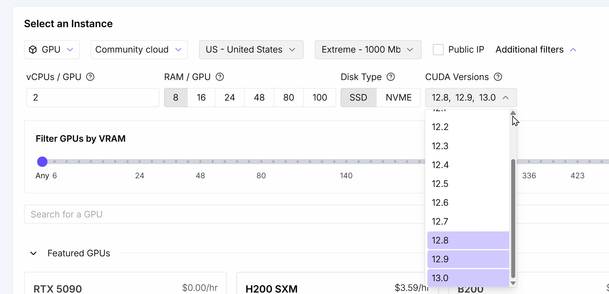
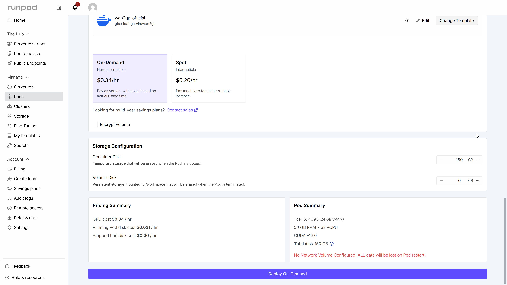
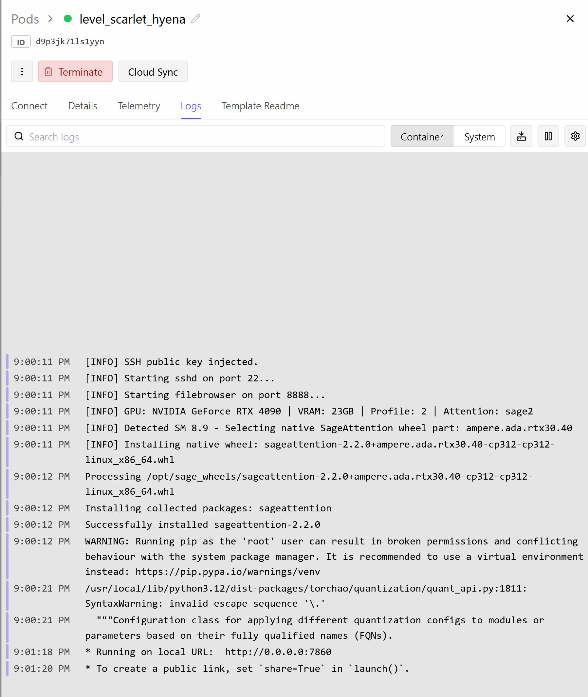
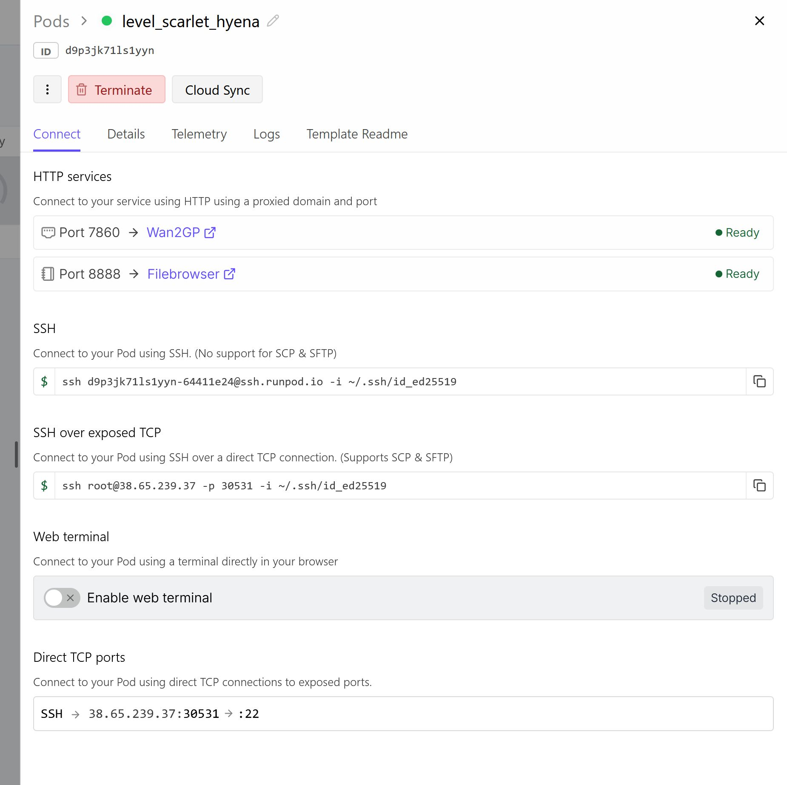
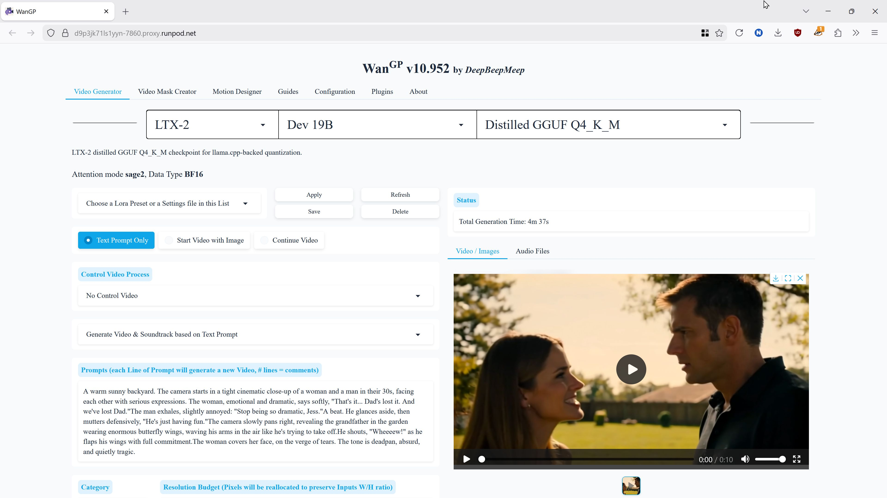
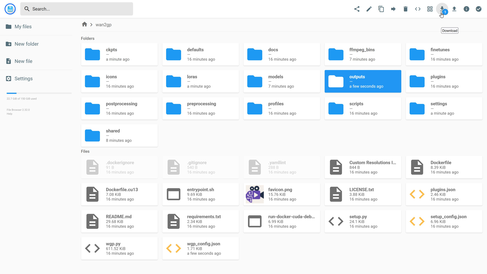

# ☁️ RunPod Deployment Guide: Wan2GP ☁️

Follow this guide to deploy Wan2GP on RunPod. This environment is optimized for high-performance video generation, utilizing CUDA 13.0 and Blackwell-specific kernels where available.

---

### 1. Select Your GPU
Choose a GPU. Wan2GP will happily run on any NVidia GPU you can get your hands on.  For performance reasons, however, the official Docker images are built for CUDA 12.8 and CUDA 13.0.  So you MUST filter your selections by those machines which have those CUDA versions installed.  The CUDA 13 image is the most performant, and strictly required to enjoy hardware NVFP4 acceleration, but as of this writing very few server clusters have upgraded to CUDA 13.0.  

### 2. Configure & Deploy
Search for the Official Wan2GP template.  Ensure that your environment variables and volume mounts are configured to your liking.  The default settings are a good place to start. If you would prefer to pay monthly storage fees in exchange for faster loading times, you can add persistent storage.  It is recommended to take not less than 100GB if you take any.   

> [!IMPORTANT]
> When using the CUDA 13.0 image, ensure you are filtering for GPUs that have CUDA 13.0 installed.  

Click **Deploy On-Demand** to start your pod.

### 3. Monitor Initialization
While the pod starts, you can monitor the setup process via the **System Logs**. This is where you can verify that the machine has spun up and loaded the SageAttention 2++ weights.

### 4. Connect to the UI
Once the pod is "Running," click the **Connect** button to access the Wan2GP interface or the convenient web-based file browser.

### 5. Generate Video
At this point, the Gradio interface is your playground.  Models will download automatically on first use -- be patient.  Have fun!

### 6. Download Your Work and Terminate the Pod

---

  <b>Wan2GP by Deepbeepmeep</b>

